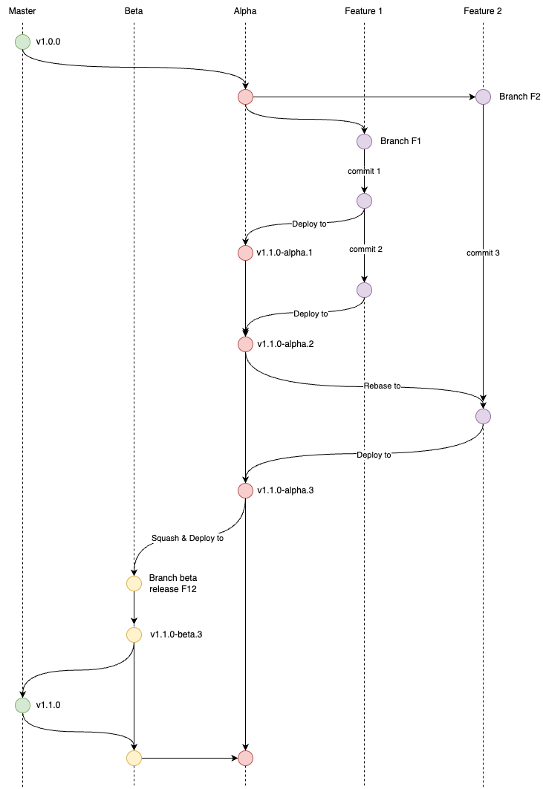
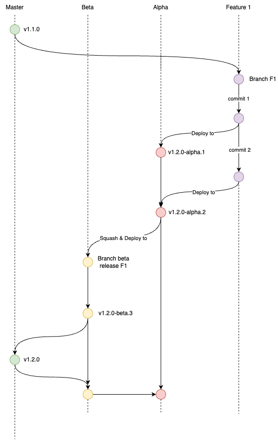

# Hasurify Util Library

[](https://github.com/hasurify/util/actions/workflows/release.yml)
[](https://badge.fury.io/js/angular2-expandable-list)
[](https://github.com/prettier/prettier)

> This repository is to define the util helpers for Hasurify

## Prerequisites

Please use [NodeJS version 18](https://nodejs.org/en/blog/release/v18.17.0) or higher and [Yarn](https://classic.yarnpkg.com/lang/en/docs/install/#mac-stable) for the package manager.

## Getting Started

These instructions will get you a copy of the package up and running on your local machine for development and testing purposes. See deployment for notes on how to deploy the project on a live system.

## Installation

This is a private NPM package. So, to use it in your project, please make sure that you have authenticated with your NPM registry account.

```sh
$ export NPM_TOKEN=<NPM_TOKEN>
$ echo -e "//npm.pkg.github.com/:_authToken=$NPM_TOKEN\n\
@hasurify:registry=https://npm.pkg.github.com/" > ~/.npmrc
```

`NPM_TOKEN` is generated from your github account. See how to [creating a personal access token](https://docs.github.com/en/github/authenticating-to-github/keeping-your-account-and-data-secure/creating-a-personal-access-token).

> Note: If you want to build a docker image with NPM registry permission, please remove the file `.npmrc` after you finish to install NPM packages.

Use npm CLI

```sh
$ npm i @hasurify/util@1.0.0
```

Use yarn CLI

```sh
$ yarn add @hasurify/util@1.0.0
```

## Development

We'll be setting up our repo to use AngularJS's commit message convention, also known as conventional-changelog. To go with it, we'll be using [commitizen](https://github.com/commitizen/cz-cli) and [cz-conventional-changelog](https://github.com/commitizen/cz-conventional-changelog).

So, instead of using `git commit -m "Message"`, please use `yarn commit`.

## Release workflow

We are using [semantic release](https://github.com/semantic-release/semantic-release) strategy for this NPM package. It's required to follow [Angular Commit Message Conventions](https://github.com/angular/angular/blob/master/CONTRIBUTING.md#-commit-message-format). The commit message format can be changed with the [preset or config options](https://github.com/semantic-release/semantic-release/blob/master/docs/usage/configuration.md#options) of the [@semantic-release/commit-analyzer](https://github.com/semantic-release/commit-analyzer#options) and [@semantic-release/release-notes-generator](https://github.com/semantic-release/release-notes-generator#options) plugins.

### Version release



Let's assume the latest stable tag of the protected branches (master, beta, and alpha) is `v1.0.0`. You will now start working on a new feature. Please follow the steps below:

1. Create a new feature branch `(feat or fix or chore)/short_desc` from `alpha` branch to work on.
2. Make a new commit to the feature branch using `git add . && yarn commit`. For more information on commit message conventions, please refer to the [commitizen](https://github.com/commitizen/cz-cli) and [cz-conventional-changelog](https://github.com/commitizen/cz-conventional-changelog) guidelines. You can enter the JIRA ticket ID or feature name for the `component`.
3. Cherry-pick and push that commit or create a PR to the `alpha` branch in order to publish a new alpha version called `v1.1.0-alpha.1`. This action will also create a new tag with the same name and a [new pre-release](https://github.com/hasurify/util/releases). The pre-release note will include all your commit messages, publishing time, and contributors.
4. Continue working if necessary.
5. Rebase the `alpha` branch to incorporate the new tag into your branch. If you skip this step, the CI will be unable to publish a new version for your next commit.
6. Make another commit to the feature branch using `git add . && yarn commit`.
7. Repeat step 3 for this new commit. The CI will run to publish a new version called `v1.1.0-alpha.2`.
8. Install the new version of the package on Backend or Frontend to carefully verify it in your local and development environment.
9. Create a new branch from the `beta` branch and then cherry-pick all the commits into it.
10. Create a new PR to the `beta` branch.
11. Once other developers have reviewed, approved, and merged that PR, the CI will run to publish a new beta version called `v1.1.0-beta.1`.
12. Install the beta version of the package on your Backend or Frontend branch, which is created from the `beta` branch, for thorough verification.

At the end of the development version (sprint), we will deploy all the changes from the `beta` branch to the `master` branch. The CI will release the stable version.

### Hotfix release



The hotfix release workflow is similar to the version release. The only difference is that you will be required to create a new branch from the `master` branch instead of `alpha`. Then, you need to deploy to `alpha` in order to verify the hotfix version on the Backend or Frontend development environment. After that, you will follow the same steps as the version release.

> Note: You're not allowed to publish the new NPM version directly from your local machine.

## Troubleshooting

You're not be allowed to overwrite the old version of package. If you want to do it, please delete that specific version on Github registry then update the version in the `package.json` or use command `npm version patch/minor/major`.
